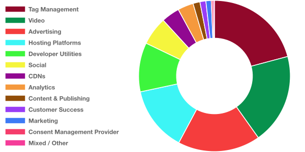

# [Third Party Web](https://www.thirdpartyweb.today/)

## Check out the shiny new web UI https://www.thirdpartyweb.today/

Data on third party entities and their impact on the web.

This document is a summary of which third party scripts are most responsible for excessive JavaScript execution on the web today.

## Table of Contents

1.  [Goals](#goals)
1.  [Methodology](#methodology)
1.  [npm Module](#npm-module)
1.  [Updates](#updates)
1.  [Data](#data)
    1.  [Summary](#summary)
    1.  [How to Interpret](#how-to-interpret)
    1.  [Third Parties by Category](#by-category)
        1.  [Advertising](#ad)
        1.  [Analytics](#analytics)
        1.  [Social](#social)
        1.  [Video](#video)
        1.  [Developer Utilities](#utility)
        1.  [Hosting Platforms](#hosting)
        1.  [Marketing](#marketing)
        1.  [Customer Success](#customer-success)
        1.  [Content & Publishing](#content)
        1.  [CDNs](#cdn)
        1.  [Tag Management](#tag-manager)
        1.  [Consent Management Provider](#consent-provider)
        1.  [Mixed / Other](#other)
    1.  [Third Parties by Total Impact](#by-total-impact)
1.  [Future Work](#future-work)
1.  [FAQs](#faqs)
1.  [Contributing](#contributing)

## Goals

1.  Quantify the impact of third party scripts on the web.
1.  Identify the third party scripts on the web that have the greatest performance cost.
1.  Give developers the information they need to make informed decisions about which third parties to include on their sites.
1.  Incentivize responsible third party script behavior.
1.  Make this information accessible and useful.

## Methodology

[HTTP Archive](https://httparchive.org/) is an initiative that tracks how the web is built. Every month, ~4 million sites are crawled with [Lighthouse](https://github.com/GoogleChrome/lighthouse) on mobile. Lighthouse breaks down the total script execution time of each page and attributes the execution to a URL. Using [BigQuery](https://cloud.google.com/bigquery/), this project aggregates the script execution to the origin-level and assigns each origin to the responsible entity.

## npm Module

The entity classification data is available as an npm module.

```js
const {getEntity} = require('third-party-web')
const entity = getEntity('https://d36mpcpuzc4ztk.cloudfront.net/js/visitor.js')
console.log(entity)
//   {
//     "name": "Freshdesk",
//     "homepage": "https://freshdesk.com/",
//     "category": "customer-success",
//     "domains": ["d36mpcpuzc4ztk.cloudfront.net"]
//   }
```

## Updates

## 2021-01-01 dataset

Due to a change in HTTPArchive measurement which temporarily disabled site-isolation (out-of-process iframes), all of the third-parties whose work previously took place off the main-thread are now counted _on_ the main thread (and thus appear in our stats). This is most evident in the change to Google-owned properties such as YouTube and Doubleclick whose _complete_ cost are now captured.

## 2019-05-13 dataset

A shortcoming of the attribution approach has been fixed. Total usage is now reported based on the number of _pages_ in the dataset that use the third-party, not the number of _scripts_. Correspondingly, all average impact times are now reported _per page_ rather than _per script_. Previously, a third party could appear to have a lower impact or be more popular simply by splitting their work across multiple files.

Third-parties that performed most of their work from a single script should see little to no impact from this change, but some entities have seen significant ranking movement. Hosting providers that host entire pages are, understandably, the most affected.

Some notable changes below:

| Third-Party | Previously (per-script) | Now (per-page) |
| ----------- | ----------------------- | -------------- |
| Beeketing   | 137 ms                  | 465 ms         |
| Sumo        | 263 ms                  | 798 ms         |
| Tumblr      | 324 ms                  | 1499 ms        |
| Yandex APIs | 393 ms                  | 1231 ms        |
| Google Ads  | 402 ms                  | 1285 ms        |
| Wix         | 972 ms                  | 5393 ms        |

## 2019-05-06 dataset

Google Ads clarified that `www.googletagservices.com` serves more ad scripts than generic tag management, and it has been reclassified accordingly. This has dropped the overall Tag Management share considerably back down to its earlier position.

## 2019-03-01 dataset

Almost 2,000 entities tracked now across ~3,000+ domains! Huge props to [@simonhearne](https://twitter.com/simonhearne) for making this massive increase possible. Tag Managers have now been split out into their own category since they represented such a large percentage of the "Mixed / Other" category.

## 2019-02-01 dataset

Huge props to [WordAds](https://wordads.co/) for reducing their impact from ~2.5s to ~200ms on average! A few entities are showing considerably less data this cycle (Media Math, Crazy Egg, DoubleVerify, Bootstrap CDN). Perhaps they've added new CDNs/hostnames that we haven't identified or the basket of sites in HTTPArchive has shifted away from their usage.

## Data

### Summary

Across top ~4 million sites, ~2700 origins account for ~57% of all script execution time with the top 50 entities already accounting for ~47%. Third party script execution is the majority chunk of the web today, and it's important to make informed choices.

### How to Interpret

Each entity has a number of data points available.

1.  **Usage (Total Number of Occurrences)** - how many scripts from their origins were included on pages
1.  **Total Impact (Total Execution Time)** - how many seconds were spent executing their scripts across the web
1.  **Average Impact (Average Execution Time)** - on average, how many milliseconds were spent executing each script
1.  **Category** - what type of script is this

<a name="by-category"></a>

### Third Parties by Category

This section breaks down third parties by category. The third parties in each category are ranked from first to last based on the average impact of their scripts. Perhaps the most important comparisons lie here. You always need to pick an analytics provider, but at least you can pick the most well-behaved analytics provider.

#### Overall Breakdown

Unsurprisingly, ads account for the largest identifiable chunk of third party script execution.



<a name="ad"></a>

#### Advertising

These scripts are part of advertising networks, either serving or measuring.

| Rank | Name                                                                             | Usage     | Average Impact |
| ---- | -------------------------------------------------------------------------------- | --------- | -------------- |
| 1    | Unruly Media                                                                     | 5,165     | 0 ms           |
| 2    | Nativo                                                                           | 23,319    | 0 ms           |
| 3    | [Bidswitch](https://www.bidswitch.com/)                                          | 64,373    | 0 ms           |
| 4    | AdGear                                                                           | 40,592    | 1 ms           |
| 5    | MaxPoint Interactive                                                             | 7,960     | 1 ms           |
| 6    | Tribal Fusion                                                                    | 104,276   | 1 ms           |
| 7    | Crimtan                                                                          | 52,016    | 1 ms           |
| 8    | [iPROM](https://iprom.eu/)                                                       | 49,159    | 2 ms           |
| 9    | adKernel                                                                         | 8,910     | 2 ms           |
| 10   | TripleLift                                                                       | 3,895     | 2 ms           |
| 11   | Beeswax                                                                          | 6,050     | 2 ms           |
| 12   | Bidtellect                                                                       | 3,343     | 6 ms           |
| 13   | [33 Across](https://33across.com/)                                               | 130,982   | 15 ms          |
| 14   | Adform                                                                           | 76,151    | 23 ms          |
| 15   | [AppNexus](https://www.appnexus.com/)                                            | 150,303   | 23 ms          |
| 16   | GumGum                                                                           | 113,191   | 25 ms          |
| 17   | Constant Contact                                                                 | 17,524    | 33 ms          |
| 18   | Adyoulike                                                                        | 3,785     | 33 ms          |
| 19   | LoopMe                                                                           | 34,649    | 40 ms          |
| 20   | Sonobi                                                                           | 48,480    | 50 ms          |
| 21   | OneTag                                                                           | 26,421    | 58 ms          |
| 22   | RTB House AdPilot                                                                | 5,431     | 60 ms          |
| 23   | Simpli.fi                                                                        | 9,640     | 63 ms          |
| 24   | [AdFuel Video](https://goadfuel.com/)                                            | 2,204     | 65 ms          |
| 25   | MailMunch                                                                        | 16,346    | 65 ms          |
| 26   | [The Trade Desk](https://www.thetradedesk.com/)                                  | 14,402    | 68 ms          |
| 27   | SiteScout                                                                        | 2,183     | 75 ms          |
| 28   | [OpenX](https://www.openx.com/)                                                  | 66,692    | 77 ms          |
| 29   | Twitter Online Conversion Tracking                                               | 68,207    | 77 ms          |
| 30   | BlueCava                                                                         | 4,645     | 80 ms          |
| 31   | ActiveCampaign                                                                   | 17,077    | 81 ms          |
| 32   | StackAdapt                                                                       | 13,485    | 82 ms          |
| 33   | [Scorecard Research](https://www.scorecardresearch.com/)                         | 45,137    | 83 ms          |
| 34   | DTSCOUT                                                                          | 5,848     | 83 ms          |
| 35   | Affiliate Window                                                                 | 4,652     | 90 ms          |
| 36   | Branch Metrics                                                                   | 11,234    | 91 ms          |
| 37   | LinkedIn Ads                                                                     | 181,213   | 92 ms          |
| 38   | Rocket Fuel                                                                      | 2,825     | 94 ms          |
| 39   | sovrn                                                                            | 21,719    | 111 ms         |
| 40   | [Yahoo!](https://www.yahoo.com/)                                                 | 20,782    | 113 ms         |
| 41   | [Criteo](https://www.criteo.com/)                                                | 153,536   | 118 ms         |
| 42   | AudienceSearch                                                                   | 43,349    | 132 ms         |
| 43   | Index Exchange                                                                   | 30,990    | 133 ms         |
| 44   | [Quora Ads](https://www.quora.com/business/)                                     | 9,943     | 140 ms         |
| 45   | LINE Corporation                                                                 | 24,271    | 143 ms         |
| 46   | Crowd Control                                                                    | 83,913    | 146 ms         |
| 47   | Gemius                                                                           | 15,845    | 149 ms         |
| 48   | STINGRAY                                                                         | 6,811     | 152 ms         |
| 49   | Intercept Interactive                                                            | 18,073    | 154 ms         |
| 50   | Boomtrain                                                                        | 2,222     | 155 ms         |
| 51   | ucfunnel ucX                                                                     | 8,507     | 161 ms         |
| 52   | Simplicity Marketing                                                             | 2,610     | 162 ms         |
| 53   | [Bing Ads](https://bingads.microsoft.com)                                        | 47,579    | 165 ms         |
| 54   | IPONWEB                                                                          | 24,945    | 165 ms         |
| 55   | AdRiver                                                                          | 4,142     | 174 ms         |
| 56   | TVSquared                                                                        | 4,938     | 180 ms         |
| 57   | Technorati                                                                       | 22,687    | 188 ms         |
| 58   | Smart AdServer                                                                   | 99,407    | 199 ms         |
| 59   | Tynt                                                                             | 150,037   | 203 ms         |
| 60   | InMobi                                                                           | 94,109    | 207 ms         |
| 61   | Microad                                                                          | 6,816     | 225 ms         |
| 62   | [Outbrain](https://www.outbrain.com/)                                            | 11,336    | 231 ms         |
| 63   | [Media.net](https://www.media.net/)                                              | 84,083    | 233 ms         |
| 64   | i-mobile                                                                         | 4,863     | 236 ms         |
| 65   | Salesforce.com                                                                   | 5,142     | 244 ms         |
| 66   | [ID5 Identity Cloud](https://id5.io/)                                            | 61,561    | 247 ms         |
| 67   | TrafficStars                                                                     | 7,761     | 255 ms         |
| 68   | Unbounce                                                                         | 9,031     | 286 ms         |
| 69   | [LiveRamp Privacy Manager](https://liveramp.com/privacy-legal-compliance/)       | 18,102    | 300 ms         |
| 70   | Teads                                                                            | 6,162     | 301 ms         |
| 71   | [Amazon Ads](https://ad.amazon.com/)                                             | 175,183   | 301 ms         |
| 72   | [Adroll](https://www.adroll.com/)                                                | 29,368    | 308 ms         |
| 73   | fluct                                                                            | 13,776    | 317 ms         |
| 74   | Skimbit                                                                          | 79,082    | 326 ms         |
| 75   | [Supership](https://supership.jp/)                                               | 17,742    | 373 ms         |
| 76   | [Attentive](https://attentivemobile.com/)                                        | 8,692     | 497 ms         |
| 77   | Cxense                                                                           | 3,742     | 515 ms         |
| 78   | VigLink                                                                          | 6,441     | 563 ms         |
| 79   | OptiMonk                                                                         | 10,175    | 594 ms         |
| 80   | Klaviyo                                                                          | 141,506   | 595 ms         |
| 81   | Privy                                                                            | 18,266    | 608 ms         |
| 82   | [WordAds](https://wordads.co/)                                                   | 91,869    | 629 ms         |
| 83   | [Integral Ad Science](https://integralads.com/uk/)                               | 15,170    | 671 ms         |
| 84   | [AdScore](https://www.adscore.com/)                                              | 4,392     | 762 ms         |
| 85   | LongTail Ad Solutions                                                            | 6,016     | 763 ms         |
| 86   | [Taboola](https://www.taboola.com/)                                              | 48,303    | 768 ms         |
| 87   | LoyaltyLion                                                                      | 3,892     | 796 ms         |
| 88   | [Moat](https://moat.com/)                                                        | 3,508     | 883 ms         |
| 89   | [Rubicon Project](https://rubiconproject.com/)                                   | 207,349   | 925 ms         |
| 90   | Geniee                                                                           | 15,662    | 960 ms         |
| 91   | [DoubleVerify](https://www.doubleverify.com/)                                    | 3,648     | 1122 ms        |
| 92   | [Sizmek](https://www.sizmek.com/)                                                | 5,293     | 1433 ms        |
| 93   | [Pubmatic](https://pubmatic.com/)                                                | 214,223   | 1545 ms        |
| 94   | [Ad Lightning](https://www.adlightning.com/)                                     | 3,865     | 1608 ms        |
| 95   | Infolinks                                                                        | 6,073     | 1617 ms        |
| 96   | [Seedtag](https://www.seedtag.com/)                                              | 2,433     | 1805 ms        |
| 97   | [MGID](https://www.mgid.com/)                                                    | 8,796     | 2016 ms        |
| 98   | Yahoo! Ad Exchange                                                               | 5,024     | 2855 ms        |
| 99   | [Google/Doubleclick Ads](https://marketingplatform.google.com/about/enterprise/) | 1,148,525 | 2916 ms        |
| 100  | [Mediavine](https://www.mediavine.com/)                                          | 10,838    | 3682 ms        |

<a name="analytics"></a>

#### Analytics

These scripts measure or track users and their actions. There's a wide range in impact here depending on what's being tracked.

| Rank | Name                                                                          | Usage     | Average Impact |
| ---- | ----------------------------------------------------------------------------- | --------- | -------------- |
| 1    | [Mouseflow](https://mouseflow.com/)                                           | 4,807     | 47 ms          |
| 2    | [SpeedCurve RUM](https://www.speedcurve.com/features/performance-monitoring/) | 3,783     | 61 ms          |
| 3    | Roxr Software                                                                 | 10,355    | 63 ms          |
| 4    | Movable Ink                                                                   | 4,709     | 78 ms          |
| 5    | Sailthru                                                                      | 1,259     | 82 ms          |
| 6    | [Smartlook](https://www.smartlook.com/)                                       | 14,858    | 89 ms          |
| 7    | Woopra                                                                        | 1,222     | 95 ms          |
| 8    | [LiveRamp IdentityLink](https://liveramp.com/discover-identitylink/)          | 1,557     | 96 ms          |
| 9    | Treasure Data                                                                 | 13,192    | 97 ms          |
| 10   | [mPulse](https://developer.akamai.com/akamai-mpulse)                          | 30,608    | 98 ms          |
| 11   | [XiTi](https://www.atinternet.com/en/)                                        | 5,761     | 100 ms         |
| 12   | StatCounter                                                                   | 50,601    | 101 ms         |
| 13   | Exponea                                                                       | 1,288     | 105 ms         |
| 14   | Conversant                                                                    | 47,289    | 108 ms         |
| 15   | [Google Analytics](https://marketingplatform.google.com/about/analytics/)     | 4,270,034 | 108 ms         |
| 16   | [Brandmetrics](https://www.brandmetrics.com)                                  | 18,600    | 112 ms         |
| 17   | Polldaddy                                                                     | 2,045     | 113 ms         |
| 18   | Stamped.io                                                                    | 11,913    | 133 ms         |
| 19   | [Usabilla](https://usabilla.com)                                              | 1,306     | 137 ms         |
| 20   | [Mixpanel](https://mixpanel.com/)                                             | 17,976    | 157 ms         |
| 21   | [Quantcast](https://www.quantcast.com)                                        | 62,298    | 162 ms         |
| 22   | [Braze](https://www.braze.com)                                                | 1,878     | 162 ms         |
| 23   | Marchex                                                                       | 6,144     | 163 ms         |
| 24   | Reviews.co.uk                                                                 | 1,888     | 170 ms         |
| 25   | Smart Insight Tracking                                                        | 1,749     | 180 ms         |
| 26   | [Plausible](https://plausible.io/)                                            | 7,065     | 186 ms         |
| 27   | [Matomo](https://matomo.org/)                                                 | 13,769    | 193 ms         |
| 28   | Amplitude Mobile Analytics                                                    | 35,019    | 198 ms         |
| 29   | Chartbeat                                                                     | 6,306     | 199 ms         |
| 30   | Parse.ly                                                                      | 6,013     | 215 ms         |
| 31   | [Clearbit](https://clearbit.com/)                                             | 4,050     | 219 ms         |
| 32   | Trust Pilot                                                                   | 43,901    | 234 ms         |
| 33   | CallRail                                                                      | 28,748    | 235 ms         |
| 34   | UpSellit                                                                      | 2,967     | 239 ms         |
| 35   | CallTrackingMetrics                                                           | 7,768     | 242 ms         |
| 36   | etracker                                                                      | 5,541     | 265 ms         |
| 37   | [PageSense](https://www.zoho.com/pagesense/)                                  | 5,634     | 277 ms         |
| 38   | [Nielsen NetRatings SiteCensus](http://www.nielsen-online.com/intlpage.html)  | 16,365    | 336 ms         |
| 39   | Survicate                                                                     | 3,250     | 350 ms         |
| 40   | [Pendo](https://www.pendo.io)                                                 | 12,447    | 354 ms         |
| 41   | Reviews.io                                                                    | 4,135     | 356 ms         |
| 42   | [Segment](https://segment.com/)                                               | 26,540    | 366 ms         |
| 43   | Evergage                                                                      | 2,654     | 372 ms         |
| 44   | Heap                                                                          | 13,259    | 380 ms         |
| 45   | Okta                                                                          | 3,300     | 381 ms         |
| 46   | [Marketo](https://www.marketo.com)                                            | 1,802     | 388 ms         |
| 47   | [Snapchat](https://www.snapchat.com)                                          | 48,630    | 398 ms         |
| 48   | Bazaarvoice                                                                   | 3,173     | 420 ms         |
| 49   | Net Reviews                                                                   | 2,645     | 435 ms         |
| 50   | [AB Tasty](https://www.abtasty.com/)                                          | 3,198     | 461 ms         |
| 51   | [BowNow](https://bow-now.jp/)                                                 | 2,318     | 490 ms         |
| 52   | Evidon                                                                        | 2,296     | 517 ms         |
| 53   | Convert Insights                                                              | 4,048     | 519 ms         |
| 54   | [Crazy Egg](https://www.crazyegg.com/)                                        | 19,738    | 520 ms         |
| 55   | Feefo.com                                                                     | 1,961     | 591 ms         |
| 56   | [Appcues](https://www.appcues.com/)                                           | 2,378     | 592 ms         |
| 57   | [VWO](https://vwo.com)                                                        | 7,602     | 618 ms         |
| 58   | Nosto                                                                         | 1,141     | 634 ms         |
| 59   | [Hotjar](https://www.hotjar.com/)                                             | 321,477   | 638 ms         |
| 60   | FullStory                                                                     | 13,065    | 679 ms         |
| 61   | Qualtrics                                                                     | 6,873     | 681 ms         |
| 62   | PowerReviews                                                                  | 1,475     | 777 ms         |
| 63   | Clerk.io ApS                                                                  | 1,924     | 792 ms         |
| 64   | [Optimizely](https://www.optimizely.com/)                                     | 13,015    | 796 ms         |
| 65   | ContentSquare                                                                 | 2,621     | 893 ms         |
| 66   | [Kameleoon](https://www.kameleoon.com/)                                       | 2,194     | 912 ms         |
| 67   | Insider                                                                       | 1,864     | 974 ms         |
| 68   | TrackJS                                                                       | 1,452     | 985 ms         |
| 69   | Revolver Maps                                                                 | 2,006     | 1035 ms        |
| 70   | Gigya                                                                         | 2,012     | 1231 ms        |
| 71   | [Quantum Metric](https://www.quantummetric.com/)                              | 1,149     | 1275 ms        |
| 72   | Inspectlet                                                                    | 5,142     | 1357 ms        |
| 73   | [Lucky Orange](https://www.luckyorange.com/)                                  | 4,231     | 1404 ms        |

<a name="social"></a>

#### Social

These scripts enable social features.

| Rank | Name                                    | Usage     | Average Impact |
| ---- | --------------------------------------- | --------- | -------------- |
| 1    | [Pinterest](https://pinterest.com/)     | 126,785   | 121 ms         |
| 2    | [AddToAny](https://www.addtoany.com/)   | 63,826    | 143 ms         |
| 3    | reddit                                  | 16,177    | 213 ms         |
| 4    | AddShoppers                             | 1,843     | 324 ms         |
| 5    | [ShareThis](https://www.sharethis.com/) | 86,550    | 328 ms         |
| 6    | [Facebook](https://www.facebook.com)    | 3,103,715 | 380 ms         |
| 7    | [TikTok](https://www.tiktok.com/en/)    | 220,242   | 448 ms         |
| 8    | Kakao                                   | 64,116    | 628 ms         |
| 9    | [PIXNET](https://www.pixnet.net/)       | 14,881    | 819 ms         |
| 10   | [Instagram](https://www.instagram.com)  | 17,163    | 1278 ms        |
| 11   | SocialShopWave                          | 4,000     | 1463 ms        |
| 12   | [Disqus](https://disqus.com/)           | 1,780     | 1999 ms        |
| 13   | [Tumblr](https://tumblr.com/)           | 15,962    | 2663 ms        |
| 14   | [VK](https://vk.com/)                   | 24,777    | 2779 ms        |
| 15   | LiveJournal                             | 9,027     | 6134 ms        |

<a name="video"></a>

#### Video

These scripts enable video player and streaming functionality.

| Rank | Name                                         | Usage   | Average Impact |
| ---- | -------------------------------------------- | ------- | -------------- |
| 1    | [Brightcove](https://www.brightcove.com/en/) | 12,833  | 1070 ms        |
| 2    | [Vimeo](https://vimeo.com/)                  | 137,380 | 2728 ms        |
| 3    | [Wistia](https://wistia.com/)                | 26,317  | 3722 ms        |
| 4    | [YouTube](https://youtube.com)               | 938,797 | 4858 ms        |
| 5    | [Twitch](https://twitch.tv/)                 | 1,446   | 13724 ms       |

<a name="utility"></a>

#### Developer Utilities

These scripts are developer utilities (API clients, site monitoring, fraud detection, etc).

| Rank | Name                                                      | Usage     | Average Impact |
| ---- | --------------------------------------------------------- | --------- | -------------- |
| 1    | [Statuspage](https://www.statuspage.io)                   | 1,202     | 30 ms          |
| 2    | Siteimprove                                               | 9,357     | 75 ms          |
| 3    | Rollbar                                                   | 1,622     | 84 ms          |
| 4    | Raygun                                                    | 2,108     | 85 ms          |
| 5    | [Pusher](https://pusher.com/)                             | 1,378     | 92 ms          |
| 6    | [Checkout.com](https://www.checkout.com)                  | 1,196     | 98 ms          |
| 7    | iovation                                                  | 2,103     | 107 ms         |
| 8    | Klarna                                                    | 8,565     | 110 ms         |
| 9    | CyberSource (Visa)                                        | 2,058     | 133 ms         |
| 10   | [Ipify](https://www.ipify.org)                            | 2,000     | 140 ms         |
| 11   | [Afterpay](https://www.afterpay.com/)                     | 7,759     | 154 ms         |
| 12   | Bitly                                                     | 2,956     | 160 ms         |
| 13   | Seznam                                                    | 8,535     | 160 ms         |
| 14   | [Amazon Pay](https://pay.amazon.com)                      | 6,517     | 163 ms         |
| 15   | Macropod BugHerd                                          | 2,479     | 167 ms         |
| 16   | [Netlify](https://www.netlify.com/)                       | 1,298     | 196 ms         |
| 17   | Highcharts                                                | 3,096     | 205 ms         |
| 18   | LightWidget                                               | 10,721    | 215 ms         |
| 19   | Riskified                                                 | 1,842     | 216 ms         |
| 20   | Cookie-Script.com                                         | 47,155    | 221 ms         |
| 21   | Wufoo                                                     | 1,541     | 227 ms         |
| 22   | [New Relic](https://newrelic.com/)                        | 229,493   | 243 ms         |
| 23   | [OneSignal](https://onesignal.com/)                       | 64,803    | 248 ms         |
| 24   | [Foxentry](https://foxentry.cz/)                          | 1,884     | 282 ms         |
| 25   | Google reCAPTCHA                                          | 35,607    | 289 ms         |
| 26   | [Accessibe Accessibility Overlay](https://accessibe.com/) | 47,989    | 306 ms         |
| 27   | [Cookiebot](https://www.cookiebot.com/)                   | 175,618   | 308 ms         |
| 28   | Swiftype                                                  | 1,057     | 343 ms         |
| 29   | [TrustArc](https://www.trustarc.com/)                     | 6,258     | 344 ms         |
| 30   | [Clarity](https://clarity.microsoft.com/)                 | 345,295   | 350 ms         |
| 31   | Hexton                                                    | 30,179    | 358 ms         |
| 32   | Trusted Shops                                             | 16,699    | 366 ms         |
| 33   | Bold Commerce                                             | 11,260    | 430 ms         |
| 34   | Key CDN                                                   | 9,021     | 440 ms         |
| 35   | Klevu Search                                              | 1,373     | 440 ms         |
| 36   | GetSiteControl                                            | 2,966     | 453 ms         |
| 37   | GitHub                                                    | 15,486    | 469 ms         |
| 38   | Affirm                                                    | 6,279     | 488 ms         |
| 39   | Google APIs                                               | 2,762,737 | 489 ms         |
| 40   | iubenda                                                   | 91,122    | 596 ms         |
| 41   | ThreatMetrix                                              | 2,785     | 604 ms         |
| 42   | [Sentry](https://sentry.io/)                              | 75,162    | 619 ms         |
| 43   | Mapbox                                                    | 18,896    | 654 ms         |
| 44   | Amazon CloudFront                                         | 438,494   | 771 ms         |
| 45   | [AppDynamics](https://www.appdynamics.com/)               | 3,374     | 851 ms         |
| 46   | [PayPal](https://paypal.com)                              | 55,378    | 859 ms         |
| 47   | Forter                                                    | 6,259     | 884 ms         |
| 48   | [GoDaddy](https://www.godaddy.com/)                       | 122,531   | 906 ms         |
| 49   | [Vidyard](https://www.vidyard.com/)                       | 1,049     | 975 ms         |
| 50   | Secomapp                                                  | 1,995     | 1053 ms        |
| 51   | [Stripe](https://stripe.com)                              | 123,686   | 1108 ms        |
| 52   | WisePops                                                  | 1,964     | 1205 ms        |
| 53   | [Luigis Box](https://www.luigisbox.com/)                  | 2,091     | 1208 ms        |
| 54   | Marker                                                    | 1,576     | 1214 ms        |
| 55   | Signyfyd                                                  | 2,407     | 1508 ms        |
| 56   | Fastly                                                    | 9,274     | 1995 ms        |
| 57   | Adyen                                                     | 2,278     | 2053 ms        |
| 58   | Datacamp                                                  | 1,217     | 2422 ms        |
| 59   | Rambler                                                   | 15,932    | 3996 ms        |
| 60   | [POWr](https://www.powr.io)                               | 37,708    | 4575 ms        |
| 61   | Esri ArcGIS                                               | 3,153     | 6061 ms        |

<a name="hosting"></a>

#### Hosting Platforms

These scripts are from web hosting platforms (WordPress, Wix, Squarespace, etc). Note that in this category, this can sometimes be the entirety of script on the page, and so the "impact" rank might be misleading. In the case of WordPress, this just indicates the libraries hosted and served _by_ WordPress not all sites using self-hosted WordPress.

| Rank | Name                                                                                      | Usage   | Average Impact |
| ---- | ----------------------------------------------------------------------------------------- | ------- | -------------- |
| 1    | [WordPress](https://wp.com/)                                                              | 100,868 | 133 ms         |
| 2    | [Blogger](https://www.blogger.com/)                                                       | 210,806 | 166 ms         |
| 3    | [Dealer](https://www.dealer.com/)                                                         | 1,940   | 332 ms         |
| 4    | Civic                                                                                     | 6,644   | 342 ms         |
| 5    | [Salesforce Commerce Cloud](https://www.salesforce.com/products/commerce-cloud/overview/) | 3,891   | 370 ms         |
| 6    | Global-e                                                                                  | 1,161   | 723 ms         |
| 7    | [Shopify](https://www.shopify.com/)                                                       | 296,099 | 765 ms         |
| 8    | Ecwid                                                                                     | 5,357   | 861 ms         |
| 9    | Rackspace                                                                                 | 1,913   | 884 ms         |
| 10   | [Tilda](https://tilda.cc/)                                                                | 67,454  | 1200 ms        |
| 11   | [Hatena Blog](https://hatenablog.com/)                                                    | 42,275  | 1949 ms        |
| 12   | [Squarespace](https://www.squarespace.com/)                                               | 233,793 | 3571 ms        |
| 13   | [WebsiteBuilder.com](https://www.websitebuilder.com)                                      | 4,754   | 4230 ms        |
| 14   | [Wix](https://www.wix.com/)                                                               | 441,849 | 4390 ms        |
| 15   | [Weebly](https://www.weebly.com/)                                                         | 65,463  | 5720 ms        |

<a name="marketing"></a>

#### Marketing

These scripts are from marketing tools that add popups/newsletters/etc.

| Rank | Name                                      | Usage   | Average Impact |
| ---- | ----------------------------------------- | ------- | -------------- |
| 1    | [Albacross](https://albacross.com/)       | 1,213   | 65 ms          |
| 2    | Madison Logic                             | 1,645   | 74 ms          |
| 3    | DemandBase                                | 2,166   | 128 ms         |
| 4    | [Convertful](https://convertful.com/)     | 1,473   | 145 ms         |
| 5    | SharpSpring                               | 2,034   | 308 ms         |
| 6    | [Listrak](https://www.listrak.com/)       | 1,160   | 392 ms         |
| 7    | [OptinMonster](https://optinmonster.com/) | 2,429   | 401 ms         |
| 8    | [Mailchimp](https://mailchimp.com/)       | 45,882  | 461 ms         |
| 9    | Sojern                                    | 4,001   | 475 ms         |
| 10   | [Hubspot](https://hubspot.com/)           | 146,199 | 511 ms         |
| 11   | Wishpond Technologies                     | 1,628   | 514 ms         |
| 12   | [Yotpo](https://www.yotpo.com/)           | 25,832  | 613 ms         |
| 13   | [iZooto](https://www.izooto.com)          | 2,303   | 618 ms         |
| 14   | [PureCars](https://www.purecars.com/)     | 1,409   | 671 ms         |
| 15   | [KARTE](https://karte.io/)                | 1,732   | 905 ms         |
| 16   | [Judge.me](https://judge.me/)             | 26,418  | 942 ms         |
| 17   | [Beeketing](https://beeketing.com/)       | 2,042   | 973 ms         |
| 18   | [Wunderkind](https://www.wunderkind.co/)  | 1,196   | 1282 ms        |
| 19   | [Sumo](https://sumo.com/)                 | 11,296  | 1386 ms        |
| 20   | Bigcommerce                               | 19,580  | 2223 ms        |
| 21   | [Drift](https://www.drift.com/)           | 5,561   | 4261 ms        |
| 22   | [Tray Commerce](https://www.tray.com.br/) | 13,778  | 4531 ms        |

<a name="customer-success"></a>

#### Customer Success

These scripts are from customer support/marketing providers that offer chat and contact solutions. These scripts are generally heavier in weight.

| Rank | Name                                                        | Usage   | Average Impact |
| ---- | ----------------------------------------------------------- | ------- | -------------- |
| 1    | iPerceptions                                                | 4,572   | 130 ms         |
| 2    | [Help Scout](https://www.helpscout.net/)                    | 4,399   | 135 ms         |
| 3    | Foursixty                                                   | 1,286   | 195 ms         |
| 4    | LiveTex                                                     | 1,892   | 222 ms         |
| 5    | WebEngage                                                   | 2,158   | 270 ms         |
| 6    | Pure Chat                                                   | 3,098   | 323 ms         |
| 7    | [Tawk.to](https://www.tawk.to/)                             | 107,992 | 361 ms         |
| 8    | [Smartsupp](https://www.smartsupp.com)                      | 21,142  | 391 ms         |
| 9    | Comm100                                                     | 1,019   | 416 ms         |
| 10   | [Jivochat](https://www.jivochat.com/)                       | 52,339  | 638 ms         |
| 11   | [LivePerson](https://www.liveperson.com/)                   | 2,680   | 665 ms         |
| 12   | [Intercom](https://www.intercom.com)                        | 32,322  | 1071 ms        |
| 13   | [LiveChat](https://www.livechat.com/)                       | 38,242  | 1073 ms        |
| 14   | [Tidio Live Chat](https://www.tidiochat.com/en/)            | 24,209  | 1159 ms        |
| 15   | [Olark](https://www.olark.com/)                             | 6,571   | 1288 ms        |
| 16   | [ZenDesk](https://zendesk.com/)                             | 72,680  | 1471 ms        |
| 17   | Dynamic Yield                                               | 1,795   | 1907 ms        |
| 18   | [Freshchat](https://www.freshworks.com/live-chat-software/) | 6,810   | 2929 ms        |

<a name="content"></a>

#### Content & Publishing

These scripts are from content providers or publishing-specific affiliate tracking.

| Rank | Name                                      | Usage  | Average Impact |
| ---- | ----------------------------------------- | ------ | -------------- |
| 1    | [Spotify](https://www.spotify.com/)       | 10,720 | 7 ms           |
| 2    | OpenTable                                 | 4,220  | 87 ms          |
| 3    | TripAdvisor                               | 2,000  | 134 ms         |
| 4    | Accuweather                               | 1,565  | 166 ms         |
| 5    | SnapWidget                                | 13,207 | 176 ms         |
| 6    | Tencent                                   | 7,153  | 286 ms         |
| 7    | Cloudinary                                | 2,473  | 522 ms         |
| 8    | Booking.com                               | 2,493  | 530 ms         |
| 9    | CPEx                                      | 1,067  | 603 ms         |
| 10   | Revcontent                                | 1,201  | 858 ms         |
| 11   | [AMP](https://amp.dev/)                   | 73,908 | 989 ms         |
| 12   | Adobe Systems                             | 1,378  | 1302 ms        |
| 13   | Embedly                                   | 10,223 | 1456 ms        |
| 14   | issuu                                     | 2,639  | 1841 ms        |
| 15   | [SoundCloud](https://www.soundcloud.com/) | 5,711  | 2408 ms        |
| 16   | [Hotmart](https://www.hotmart.com/)       | 4,020  | 2865 ms        |
| 17   | Dailymotion                               | 5,136  | 9346 ms        |
| 18   | Medium                                    | 18,170 | 10918 ms       |

<a name="cdn"></a>

#### CDNs

These are a mixture of publicly hosted open source libraries (e.g. jQuery) served over different public CDNs and private CDN usage. This category is unique in that the origin may have no responsibility for the performance of what's being served. Note that rank here does not imply one CDN is better than the other. It simply indicates that the scripts being served from that origin are lighter/heavier than the ones served by another.

| Rank | Name                                           | Usage   | Average Impact |
| ---- | ---------------------------------------------- | ------- | -------------- |
| 1    | [Bootstrap CDN](https://www.bootstrapcdn.com/) | 28,205  | 55 ms          |
| 2    | Monotype                                       | 3,181   | 204 ms         |
| 3    | [FontAwesome CDN](https://fontawesome.com/)    | 306,673 | 215 ms         |
| 4    | Microsoft Hosted Libs                          | 19,220  | 219 ms         |
| 5    | [Adobe TypeKit](https://fonts.adobe.com/)      | 98,647  | 345 ms         |
| 6    | Fort Awesome                                   | 3,838   | 357 ms         |
| 7    | [jQuery CDN](https://code.jquery.com/)         | 706,780 | 364 ms         |
| 8    | [Akamai](https://www.akamai.com/)              | 9,605   | 396 ms         |
| 9    | [JSDelivr CDN](https://www.jsdelivr.com/)      | 345,059 | 620 ms         |
| 10   | Azure Web Services                             | 49,551  | 802 ms         |
| 11   | [Unpkg](https://unpkg.com)                     | 136,612 | 965 ms         |
| 12   | [Yandex CDN](https://yandex.ru/)               | 168,332 | 1494 ms        |
| 13   | [CreateJS CDN](https://code.createjs.com/)     | 4,053   | 2868 ms        |

<a name="tag-manager"></a>

#### Tag Management

These scripts tend to load lots of other scripts and initiate many tasks.

| Rank | Name                                                                          | Usage     | Average Impact |
| ---- | ----------------------------------------------------------------------------- | --------- | -------------- |
| 1    | [Adobe Tag Manager](https://www.adobe.com/experience-platform/)               | 167,979   | 193 ms         |
| 2    | TagCommander                                                                  | 1,430     | 293 ms         |
| 3    | [Ensighten](https://www.ensighten.com/)                                       | 3,070     | 510 ms         |
| 4    | [Tealium](https://tealium.com/)                                               | 27,040    | 595 ms         |
| 5    | [Google Tag Manager](https://marketingplatform.google.com/about/tag-manager/) | 7,750,701 | 697 ms         |

<a name="consent-provider"></a>

#### Consent Management Provider

IAB Consent Management Providers are the 'Cookie Consent' popups used by many publishers. They're invoked for every page and sit on the critical path between a page loading and adverts being displayed.

| Rank | Name                                            | Usage   | Average Impact |
| ---- | ----------------------------------------------- | ------- | -------------- |
| 1    | [Trustcommander](https://www.commandersact.com) | 1,647   | 167 ms         |
| 2    | [UniConsent CMP](https://www.uniconsent.com)    | 1,221   | 314 ms         |
| 3    | [Optanon](https://www.cookielaw.org/)           | 114,606 | 430 ms         |
| 4    | [Usercentrics CMP](https://usercentrics.com)    | 47,221  | 993 ms         |

<a name="other"></a>

#### Mixed / Other

These are miscellaneous scripts delivered via a shared origin with no precise category or attribution. Help us out by identifying more origins!

| Rank | Name                                                                | Usage   | Average Impact |
| ---- | ------------------------------------------------------------------- | ------- | -------------- |
| 1    | Browser-Update.org                                                  | 12,590  | 32 ms          |
| 2    | [ReadSpeaker](https://www.readspeaker.com)                          | 5,694   | 103 ms         |
| 3    | ResponsiveVoice                                                     | 6,353   | 119 ms         |
| 4    | [Browsealoud](https://www.texthelp.com/en-gb/products/browsealoud/) | 1,771   | 308 ms         |
| 5    | [Amazon Web Services](https://aws.amazon.com/s3/)                   | 114,967 | 409 ms         |
| 6    | Heroku                                                              | 14,353  | 955 ms         |
| 7    | Calendly                                                            | 4,003   | 2382 ms        |
| 8    | uLogin                                                              | 1,408   | 3060 ms        |

<a name="by-total-impact"></a>

### Third Parties by Total Impact

This section highlights the entities responsible for the most script execution across the web. This helps inform which improvements would have the largest total impact.

| Name                                                                             | Popularity | Total Impact | Average Impact |
| -------------------------------------------------------------------------------- | ---------- | ------------ | -------------- |
| [Google Tag Manager](https://marketingplatform.google.com/about/tag-manager/)    | 7,750,701  | 5,405,994 s  | 697 ms         |
| [YouTube](https://youtube.com)                                                   | 938,797    | 4,560,336 s  | 4858 ms        |
| [Google/Doubleclick Ads](https://marketingplatform.google.com/about/enterprise/) | 1,148,525  | 3,348,945 s  | 2916 ms        |
| [Wix](https://www.wix.com/)                                                      | 441,849    | 1,939,898 s  | 4390 ms        |
| Google APIs                                                                      | 2,762,737  | 1,351,269 s  | 489 ms         |
| [Facebook](https://www.facebook.com)                                             | 3,103,715  | 1,178,628 s  | 380 ms         |
| [Squarespace](https://www.squarespace.com/)                                      | 233,793    | 834,982 s    | 3571 ms        |
| [Google Analytics](https://marketingplatform.google.com/about/analytics/)        | 4,270,034  | 462,594 s    | 108 ms         |
| [Vimeo](https://vimeo.com/)                                                      | 137,380    | 374,754 s    | 2728 ms        |
| [Weebly](https://www.weebly.com/)                                                | 65,463     | 374,457 s    | 5720 ms        |
| Amazon CloudFront                                                                | 438,494    | 338,212 s    | 771 ms         |
| [Pubmatic](https://pubmatic.com/)                                                | 214,223    | 331,070 s    | 1545 ms        |
| [jQuery CDN](https://code.jquery.com/)                                           | 706,780    | 257,591 s    | 364 ms         |
| [Yandex CDN](https://yandex.ru/)                                                 | 168,332    | 251,409 s    | 1494 ms        |
| [Shopify](https://www.shopify.com/)                                              | 296,099    | 226,454 s    | 765 ms         |
| [JSDelivr CDN](https://www.jsdelivr.com/)                                        | 345,059    | 213,879 s    | 620 ms         |
| [Hotjar](https://www.hotjar.com/)                                                | 321,477    | 205,054 s    | 638 ms         |
| Medium                                                                           | 18,170     | 198,384 s    | 10918 ms       |
| [Rubicon Project](https://rubiconproject.com/)                                   | 207,349    | 191,823 s    | 925 ms         |
| [POWr](https://www.powr.io)                                                      | 37,708     | 172,497 s    | 4575 ms        |
| [Stripe](https://stripe.com)                                                     | 123,686    | 137,094 s    | 1108 ms        |
| [Unpkg](https://unpkg.com)                                                       | 136,612    | 131,824 s    | 965 ms         |
| [Clarity](https://clarity.microsoft.com/)                                        | 345,295    | 120,722 s    | 350 ms         |
| [GoDaddy](https://www.godaddy.com/)                                              | 122,531    | 110,960 s    | 906 ms         |
| [ZenDesk](https://zendesk.com/)                                                  | 72,680     | 106,920 s    | 1471 ms        |
| [TikTok](https://www.tiktok.com/en/)                                             | 220,242    | 98,596 s     | 448 ms         |
| [Wistia](https://wistia.com/)                                                    | 26,317     | 97,947 s     | 3722 ms        |
| Klaviyo                                                                          | 141,506    | 84,178 s     | 595 ms         |
| [Hatena Blog](https://hatenablog.com/)                                           | 42,275     | 82,410 s     | 1949 ms        |
| [Tilda](https://tilda.cc/)                                                       | 67,454     | 80,949 s     | 1200 ms        |
| [Hubspot](https://hubspot.com/)                                                  | 146,199    | 74,694 s     | 511 ms         |
| [AMP](https://amp.dev/)                                                          | 73,908     | 73,126 s     | 989 ms         |
| [VK](https://vk.com/)                                                            | 24,777     | 68,862 s     | 2779 ms        |
| [FontAwesome CDN](https://fontawesome.com/)                                      | 306,673    | 65,800 s     | 215 ms         |
| Rambler                                                                          | 15,932     | 63,667 s     | 3996 ms        |
| [Tray Commerce](https://www.tray.com.br/)                                        | 13,778     | 62,434 s     | 4531 ms        |
| [WordAds](https://wordads.co/)                                                   | 91,869     | 57,759 s     | 629 ms         |
| [New Relic](https://newrelic.com/)                                               | 229,493    | 55,833 s     | 243 ms         |
| LiveJournal                                                                      | 9,027      | 55,368 s     | 6134 ms        |
| iubenda                                                                          | 91,122     | 54,311 s     | 596 ms         |
| [Cookiebot](https://www.cookiebot.com/)                                          | 175,618    | 54,088 s     | 308 ms         |
| [Amazon Ads](https://ad.amazon.com/)                                             | 175,183    | 52,740 s     | 301 ms         |
| [Optanon](https://www.cookielaw.org/)                                            | 114,606    | 49,310 s     | 430 ms         |
| Dailymotion                                                                      | 5,136      | 48,001 s     | 9346 ms        |
| [PayPal](https://paypal.com)                                                     | 55,378     | 47,552 s     | 859 ms         |
| [Amazon Web Services](https://aws.amazon.com/s3/)                                | 114,967    | 47,060 s     | 409 ms         |
| [Usercentrics CMP](https://usercentrics.com)                                     | 47,221     | 46,881 s     | 993 ms         |
| [Sentry](https://sentry.io/)                                                     | 75,162     | 46,559 s     | 619 ms         |
| Bigcommerce                                                                      | 19,580     | 43,524 s     | 2223 ms        |
| [Tumblr](https://tumblr.com/)                                                    | 15,962     | 42,503 s     | 2663 ms        |
| [LiveChat](https://www.livechat.com/)                                            | 38,242     | 41,035 s     | 1073 ms        |
| Kakao                                                                            | 64,116     | 40,275 s     | 628 ms         |
| [Mediavine](https://www.mediavine.com/)                                          | 10,838     | 39,909 s     | 3682 ms        |
| Azure Web Services                                                               | 49,551     | 39,717 s     | 802 ms         |
| [Tawk.to](https://www.tawk.to/)                                                  | 107,992    | 38,947 s     | 361 ms         |
| [Taboola](https://www.taboola.com/)                                              | 48,303     | 37,094 s     | 768 ms         |
| [Blogger](https://www.blogger.com/)                                              | 210,806    | 35,093 s     | 166 ms         |
| [Intercom](https://www.intercom.com)                                             | 32,322     | 34,611 s     | 1071 ms        |
| [Adobe TypeKit](https://fonts.adobe.com/)                                        | 98,647     | 34,065 s     | 345 ms         |
| [Jivochat](https://www.jivochat.com/)                                            | 52,339     | 33,398 s     | 638 ms         |
| [Adobe Tag Manager](https://www.adobe.com/experience-platform/)                  | 167,979    | 32,419 s     | 193 ms         |
| Tynt                                                                             | 150,037    | 30,446 s     | 203 ms         |
| [ShareThis](https://www.sharethis.com/)                                          | 86,550     | 28,406 s     | 328 ms         |
| [Tidio Live Chat](https://www.tidiochat.com/en/)                                 | 24,209     | 28,056 s     | 1159 ms        |
| Skimbit                                                                          | 79,082     | 25,805 s     | 326 ms         |
| [Judge.me](https://judge.me/)                                                    | 26,418     | 24,895 s     | 942 ms         |
| [Drift](https://www.drift.com/)                                                  | 5,561      | 23,693 s     | 4261 ms        |
| [Instagram](https://www.instagram.com)                                           | 17,163     | 21,936 s     | 1278 ms        |
| [Mailchimp](https://mailchimp.com/)                                              | 45,882     | 21,143 s     | 461 ms         |
| [WebsiteBuilder.com](https://www.websitebuilder.com)                             | 4,754      | 20,109 s     | 4230 ms        |
| [Freshchat](https://www.freshworks.com/live-chat-software/)                      | 6,810      | 19,947 s     | 2929 ms        |
| [Twitch](https://twitch.tv/)                                                     | 1,446      | 19,845 s     | 13724 ms       |
| Smart AdServer                                                                   | 99,407     | 19,754 s     | 199 ms         |
| [Media.net](https://www.media.net/)                                              | 84,083     | 19,622 s     | 233 ms         |
| InMobi                                                                           | 94,109     | 19,480 s     | 207 ms         |
| [Snapchat](https://www.snapchat.com)                                             | 48,630     | 19,363 s     | 398 ms         |
| Esri ArcGIS                                                                      | 3,153      | 19,111 s     | 6061 ms        |
| Fastly                                                                           | 9,274      | 18,502 s     | 1995 ms        |
| [Criteo](https://www.criteo.com/)                                                | 153,536    | 18,074 s     | 118 ms         |
| [MGID](https://www.mgid.com/)                                                    | 8,796      | 17,735 s     | 2016 ms        |
| LinkedIn Ads                                                                     | 181,213    | 16,608 s     | 92 ms          |
| [OneSignal](https://onesignal.com/)                                              | 64,803     | 16,099 s     | 248 ms         |
| [Tealium](https://tealium.com/)                                                  | 27,040     | 16,079 s     | 595 ms         |
| [Yotpo](https://www.yotpo.com/)                                                  | 25,832     | 15,827 s     | 613 ms         |
| [Sumo](https://sumo.com/)                                                        | 11,296     | 15,652 s     | 1386 ms        |
| [Pinterest](https://pinterest.com/)                                              | 126,785    | 15,278 s     | 121 ms         |
| [ID5 Identity Cloud](https://id5.io/)                                            | 61,561     | 15,231 s     | 247 ms         |
| Geniee                                                                           | 15,662     | 15,032 s     | 960 ms         |
| Embedly                                                                          | 10,223     | 14,888 s     | 1456 ms        |
| [Accessibe Accessibility Overlay](https://accessibe.com/)                        | 47,989     | 14,694 s     | 306 ms         |
| Yahoo! Ad Exchange                                                               | 5,024      | 14,342 s     | 2855 ms        |
| [SoundCloud](https://www.soundcloud.com/)                                        | 5,711      | 13,752 s     | 2408 ms        |
| [Brightcove](https://www.brightcove.com/en/)                                     | 12,833     | 13,734 s     | 1070 ms        |
| Heroku                                                                           | 14,353     | 13,704 s     | 955 ms         |
| [WordPress](https://wp.com/)                                                     | 100,868    | 13,396 s     | 133 ms         |
| Mapbox                                                                           | 18,896     | 12,364 s     | 654 ms         |
| Crowd Control                                                                    | 83,913     | 12,230 s     | 146 ms         |
| [PIXNET](https://www.pixnet.net/)                                                | 14,881     | 12,189 s     | 819 ms         |
| [CreateJS CDN](https://code.createjs.com/)                                       | 4,053      | 11,623 s     | 2868 ms        |
| [Hotmart](https://www.hotmart.com/)                                              | 4,020      | 11,516 s     | 2865 ms        |
| Privy                                                                            | 18,266     | 11,097 s     | 608 ms         |
| Hexton                                                                           | 30,179     | 10,806 s     | 358 ms         |
| Cookie-Script.com                                                                | 47,155     | 10,412 s     | 221 ms         |
| [Optimizely](https://www.optimizely.com/)                                        | 13,015     | 10,354 s     | 796 ms         |
| Google reCAPTCHA                                                                 | 35,607     | 10,288 s     | 289 ms         |
| Trust Pilot                                                                      | 43,901     | 10,267 s     | 234 ms         |
| [Crazy Egg](https://www.crazyegg.com/)                                           | 19,738     | 10,267 s     | 520 ms         |
| [Integral Ad Science](https://integralads.com/uk/)                               | 15,170     | 10,183 s     | 671 ms         |
| [Quantcast](https://www.quantcast.com)                                           | 62,298     | 10,071 s     | 162 ms         |
| Infolinks                                                                        | 6,073      | 9,821 s      | 1617 ms        |
| [Segment](https://segment.com/)                                                  | 26,540     | 9,706 s      | 366 ms         |
| Calendly                                                                         | 4,003      | 9,533 s      | 2382 ms        |
| [AddToAny](https://www.addtoany.com/)                                            | 63,826     | 9,140 s      | 143 ms         |
| [Adroll](https://www.adroll.com/)                                                | 29,368     | 9,056 s      | 308 ms         |
| FullStory                                                                        | 13,065     | 8,875 s      | 679 ms         |
| [Olark](https://www.olark.com/)                                                  | 6,571      | 8,465 s      | 1288 ms        |
| [Smartsupp](https://www.smartsupp.com)                                           | 21,142     | 8,262 s      | 391 ms         |
| [Bing Ads](https://bingads.microsoft.com)                                        | 47,579     | 7,849 s      | 165 ms         |
| [Sizmek](https://www.sizmek.com/)                                                | 5,293      | 7,584 s      | 1433 ms        |
| GitHub                                                                           | 15,486     | 7,260 s      | 469 ms         |
| Inspectlet                                                                       | 5,142      | 6,980 s      | 1357 ms        |
| Amplitude Mobile Analytics                                                       | 35,019     | 6,920 s      | 198 ms         |
| CallRail                                                                         | 28,748     | 6,745 s      | 235 ms         |
| [Supership](https://supership.jp/)                                               | 17,742     | 6,623 s      | 373 ms         |
| [Ad Lightning](https://www.adlightning.com/)                                     | 3,865      | 6,216 s      | 1608 ms        |
| Trusted Shops                                                                    | 16,699     | 6,116 s      | 366 ms         |
| OptiMonk                                                                         | 10,175     | 6,047 s      | 594 ms         |
| [Lucky Orange](https://www.luckyorange.com/)                                     | 4,231      | 5,942 s      | 1404 ms        |
| SocialShopWave                                                                   | 4,000      | 5,852 s      | 1463 ms        |
| AudienceSearch                                                                   | 43,349     | 5,737 s      | 132 ms         |
| Forter                                                                           | 6,259      | 5,536 s      | 884 ms         |
| [Nielsen NetRatings SiteCensus](http://www.nielsen-online.com/intlpage.html)     | 16,365     | 5,497 s      | 336 ms         |
| [LiveRamp Privacy Manager](https://liveramp.com/privacy-legal-compliance/)       | 18,102     | 5,431 s      | 300 ms         |
| Twitter Online Conversion Tracking                                               | 68,207     | 5,255 s      | 77 ms          |
| Conversant                                                                       | 47,289     | 5,119 s      | 108 ms         |
| [OpenX](https://www.openx.com/)                                                  | 66,692     | 5,109 s      | 77 ms          |
| StatCounter                                                                      | 50,601     | 5,095 s      | 101 ms         |
| Heap                                                                             | 13,259     | 5,043 s      | 380 ms         |
| issuu                                                                            | 2,639      | 4,857 s      | 1841 ms        |
| Bold Commerce                                                                    | 11,260     | 4,842 s      | 430 ms         |
| [VWO](https://vwo.com)                                                           | 7,602      | 4,700 s      | 618 ms         |
| Qualtrics                                                                        | 6,873      | 4,678 s      | 681 ms         |
| Adyen                                                                            | 2,278      | 4,678 s      | 2053 ms        |
| Ecwid                                                                            | 5,357      | 4,614 s      | 861 ms         |
| LongTail Ad Solutions                                                            | 6,016      | 4,592 s      | 763 ms         |
| [Pendo](https://www.pendo.io)                                                    | 12,447     | 4,409 s      | 354 ms         |
| [Seedtag](https://www.seedtag.com/)                                              | 2,433      | 4,392 s      | 1805 ms        |
| fluct                                                                            | 13,776     | 4,366 s      | 317 ms         |
| [Attentive](https://attentivemobile.com/)                                        | 8,692      | 4,323 s      | 497 ms         |
| uLogin                                                                           | 1,408      | 4,309 s      | 3060 ms        |
| Technorati                                                                       | 22,687     | 4,257 s      | 188 ms         |
| Microsoft Hosted Libs                                                            | 19,220     | 4,203 s      | 219 ms         |
| IPONWEB                                                                          | 24,945     | 4,127 s      | 165 ms         |
| Index Exchange                                                                   | 30,990     | 4,119 s      | 133 ms         |
| [DoubleVerify](https://www.doubleverify.com/)                                    | 3,648      | 4,095 s      | 1122 ms        |
| Key CDN                                                                          | 9,021      | 3,970 s      | 440 ms         |
| [Akamai](https://www.akamai.com/)                                                | 9,605      | 3,801 s      | 396 ms         |
| [Scorecard Research](https://www.scorecardresearch.com/)                         | 45,137     | 3,736 s      | 83 ms          |
| Signyfyd                                                                         | 2,407      | 3,630 s      | 1508 ms        |
| VigLink                                                                          | 6,441      | 3,629 s      | 563 ms         |
| [Disqus](https://disqus.com/)                                                    | 1,780      | 3,558 s      | 1999 ms        |
| [AppNexus](https://www.appnexus.com/)                                            | 150,303    | 3,479 s      | 23 ms          |
| LINE Corporation                                                                 | 24,271     | 3,459 s      | 143 ms         |
| reddit                                                                           | 16,177     | 3,451 s      | 213 ms         |
| Dynamic Yield                                                                    | 1,795      | 3,422 s      | 1907 ms        |
| [AdScore](https://www.adscore.com/)                                              | 4,392      | 3,349 s      | 762 ms         |
| LoyaltyLion                                                                      | 3,892      | 3,097 s      | 796 ms         |
| [Moat](https://moat.com/)                                                        | 3,508      | 3,097 s      | 883 ms         |
| Affirm                                                                           | 6,279      | 3,064 s      | 488 ms         |
| [mPulse](https://developer.akamai.com/akamai-mpulse)                             | 30,608     | 2,998 s      | 98 ms          |
| Datacamp                                                                         | 1,217      | 2,948 s      | 2422 ms        |
| [AppDynamics](https://www.appdynamics.com/)                                      | 3,374      | 2,871 s      | 851 ms         |
| [Mixpanel](https://mixpanel.com/)                                                | 17,976     | 2,828 s      | 157 ms         |
| GumGum                                                                           | 113,191    | 2,806 s      | 25 ms          |
| Intercept Interactive                                                            | 18,073     | 2,785 s      | 154 ms         |
| [fam](http://admin.fam-ad.com/report/)                                           | 731        | 2,685 s      | 3674 ms        |
| [Matomo](https://matomo.org/)                                                    | 13,769     | 2,653 s      | 193 ms         |
| [Outbrain](https://www.outbrain.com/)                                            | 11,336     | 2,618 s      | 231 ms         |
| Unbounce                                                                         | 9,031      | 2,582 s      | 286 ms         |
| [Luigis Box](https://www.luigisbox.com/)                                         | 2,091      | 2,526 s      | 1208 ms        |
| Gigya                                                                            | 2,012      | 2,477 s      | 1231 ms        |
| Sonobi                                                                           | 48,480     | 2,439 s      | 50 ms          |
| sovrn                                                                            | 21,719     | 2,407 s      | 111 ms         |
| WisePops                                                                         | 1,964      | 2,366 s      | 1205 ms        |
| Gemius                                                                           | 15,845     | 2,361 s      | 149 ms         |
| [Yahoo!](https://www.yahoo.com/)                                                 | 20,782     | 2,352 s      | 113 ms         |
| ContentSquare                                                                    | 2,621      | 2,340 s      | 893 ms         |
| SnapWidget                                                                       | 13,207     | 2,319 s      | 176 ms         |
| LightWidget                                                                      | 10,721     | 2,307 s      | 215 ms         |
| Civic                                                                            | 6,644      | 2,275 s      | 342 ms         |
| [TrustArc](https://www.trustarc.com/)                                            | 6,258      | 2,152 s      | 344 ms         |
| Convert Insights                                                                 | 4,048      | 2,100 s      | 519 ms         |
| Secomapp                                                                         | 1,995      | 2,100 s      | 1053 ms        |
| [Brandmetrics](https://www.brandmetrics.com)                                     | 18,600     | 2,078 s      | 112 ms         |
| Revolver Maps                                                                    | 2,006      | 2,076 s      | 1035 ms        |
| Qode Interactive                                                                 | 125        | 2,059 s      | 16474 ms       |
| Tencent                                                                          | 7,153      | 2,049 s      | 286 ms         |
| [Kameleoon](https://www.kameleoon.com/)                                          | 2,194      | 2,001 s      | 912 ms         |
| [Beeketing](https://beeketing.com/)                                              | 2,042      | 1,987 s      | 973 ms         |
| TrafficStars                                                                     | 7,761      | 1,977 s      | 255 ms         |

## Future Work

1.  Introduce URL-level data for more fine-grained analysis, i.e. which libraries from Cloudflare/Google CDNs are most expensive.
1.  Expand the scope, i.e. include more third parties and have greater entity/category coverage.

## FAQs

### I don't see entity X in the list. What's up with that?

This can be for one of several reasons:

1.  The entity does not have references to their origin on at least 50 pages in the dataset.
1.  The entity's origins have not yet been identified. See [How can I contribute?](#contribute)

### What is "Total Occurences"?

Total Occurrences is the number of pages on which the entity is included.

### How is the "Average Impact" determined?

The HTTP Archive dataset includes Lighthouse reports for each URL on mobile. Lighthouse has an audit called "bootup-time" that summarizes the amount of time that each script spent on the main thread. The "Average Impact" for an entity is the total execution time of scripts whose domain matches one of the entity's domains divided by the total number of pages that included the entity.

```
Average Impact = Total Execution Time / Total Occurrences
```

### How does Lighthouse determine the execution time of each script?

Lighthouse's bootup time audit attempts to attribute all toplevel main-thread tasks to a URL. A main thread task is attributed to the first script URL found in the stack. If you're interested in helping us improve this logic, see [Contributing](#contributing) for details.

### The data for entity X seems wrong. How can it be corrected?

Verify that the origins in `data/entities.js` are correct. Most issues will simply be the result of mislabelling of shared origins. If everything checks out, there is likely no further action and the data is valid. If you still believe there's errors, file an issue to discuss futher.

<a name="contribute"></a>

### How can I contribute?

Only about 90% of the third party script execution has been assigned to an entity. We could use your help identifying the rest! See [Contributing](#contributing) for details.

## Contributing

### Thanks

A **huge** thanks to [@simonhearne](https://twitter.com/simonhearne) and [@soulgalore](https://twitter.com/soulislove) for their assistance in classifying additional domains!

### Updating the Entities

The domain->entity mapping can be found in `data/entities.js`. Adding a new entity is as simple as adding a new array item with the following form.

```js
{
    "name": "Facebook",
    "homepage": "https://www.facebook.com",
    "category": "social",
    "domains": [
        "*.facebook.com",
        "*.fbcdn.net"
    ],
    "examples": [
        "www.facebook.com",
        "connect.facebook.net",
        "staticxx.facebook.com",
        "static.xx.fbcdn.net",
        "m.facebook.com"
    ]
}
```

### Updating Attribution Logic

The logic for attribution to individual script URLs can be found in the [Lighthouse repo](https://github.com/GoogleChrome/lighthouse). File an issue over there to discuss further.

### Updating the Data

This is now automated! Run `yarn start:update-ha-data` with a `gcp-credentials.json` file in the root directory of this project (look at `bin/automated-update.js` for the steps involved).

### Updating this README

This README is auto-generated from the templates `lib/` and the computed data. In order to update the charts, you'll need to make sure you have `cairo` installed locally in addition to `yarn install`.

```bash
# Install `cairo` and dependencies for node-canvas
brew install pkg-config cairo pango libpng jpeg giflib
# Build the requirements in this repo
yarn build
# Regenerate the README
yarn start
```

### Updating the website

The web code is located in `www/` directory of this repository. Open a PR to make changes.
